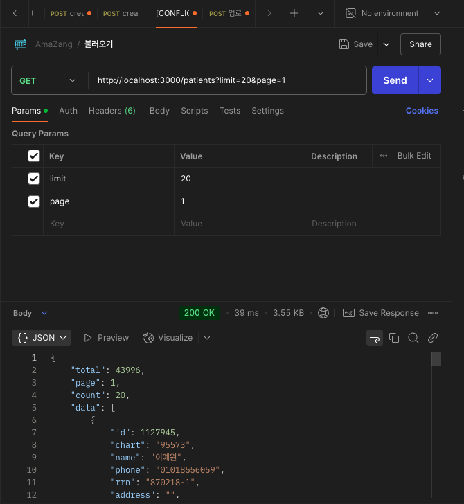

- 실행 방법

> 1. Docker compose 실행

```shell
docker compose up --build
```

도커 컴포즈 실행으로 Mysql 컨테이너를 생성 후

`mysql -u root -p 1234`

`create database motion`

순으로 실행하여 데이터베이스 생성.

> 2. .env.development.local

.env.development.local 파일을 생성한다.

`.env.example` 파일에 기재된 환경 변수를 복붙한다.

> 3. 어플리케이션 실행

core-api 경로에서 `npm run start:dev` 를 실행한다.

- 실행 결과

> 업로드


> 리스트 조회


